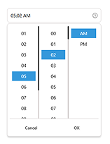
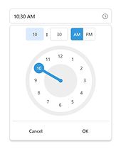

# React Timepicker Arc (RTA)

A flexible and customizable **React TimePicker** and **ClockPicker** component with multiple format support, TypeScript support, and extensive customization options.

## 🖼️ Live Examples Screenshots

[](https://timepickerarc-doc.vercel.app/docs/time-picker/examples)
[](https://timepickerarc-doc.vercel.app/docs/clock-picker/examples)

[](https://timepickerarc-doc.vercel.app)

## 🌐 Full Documentation & Live Examples

👉 **[Open Documentation](https://timepickerarc-doc.vercel.app)** - Complete guide with interactive examples

---

## ⚠️ **BREAKING CHANGES in v2.0.0**

> **🚨 IMPORTANT:** The import syntax has **completely changed** in v2.0.0. If you're upgrading from a previous version, you **must** update your imports!

### ❌ Old Import (v1.0.1) - **DEPRECATED**

```jsx
// This will NOT work in v2.0.0+
import TimePicker from "react-timepicker-arc";
import "react-timepicker-arc/dist/TimePicker.css";
```

### ✅ New Import (v2.0.0+) - **REQUIRED**

```jsx
// Use this new syntax for v2.0.0+
import { TimePicker, ClockPicker } from "react-timepicker-arc";
import "react-timepicker-arc/dist/index.css";
```

---

## ✨ Features

- 🕐 Multiple time formats (12/24 hour)
- ⏱️ **Optional seconds display (TimePicker only)**
- 🌅 AM/PM toggle
- 📝 Multiple return types (time-string, iso-string, datetime-string, unix-seconds, unix-milliseconds, date-object)
- 🎨 Customizable styling through `classNames` prop
- 📍 Positioning options (top, bottom, left, right, center)
- ✅ Built-in validation and error handling
- 🖼️ Custom icons support
- 🔘 Customizable buttons
- 📦 TypeScript support
- 🌳 Tree-shaking friendly

> **Note:** ClockPicker does **not** include a seconds selector. Seconds are supported only in TimePicker.

---

## 📦 Installation

```bash
npm install react-timepicker-arc
```

## 🔧 Usage

### Basic Usage – TimePicker

```jsx
import { TimePicker } from "react-timepicker-arc";
import "react-timepicker-arc/dist/index.css";
import { useState } from "react";

export default function App() {
  const [value, setValue] = useState("");

  return (
    <TimePicker
      value={value}
      setValue={setValue}
      onTimeChange={(time, isValid) => {
        console.log("Time:", time, "Valid:", isValid);
      }}
      showSeconds={true} // optional in TimePicker only
    />
  );
}
```

### Basic Usage – ClockPicker

```jsx
import { ClockPicker } from "react-timepicker-arc";
import "react-timepicker-arc/dist/index.css";
import { useState } from "react";

export default function App() {
  const [value, setValue] = useState("");

  return (
    <ClockPicker
      value={value}
      setValue={setValue}
      onTimeChange={(time, isValid) => {
        console.log("Time:", time, "Valid:", isValid);
      }}
      // showSeconds is not available in ClockPicker
    />
  );
}
```

## ⚙️ Props Overview

| Prop                | Type                                                 | Default            | Description                               |
| ------------------- | ---------------------------------------------------- | ------------------ | ----------------------------------------- |
| `value`             | `string \| number \| Date \| null \| undefined`      | `undefined`        | The initial time value                    |
| `setValue`          | `(value: any) => void`                               | `(value) => value` | Function called when time changes         |
| `onTimeChange`      | `(time: string, isValid: boolean) => void`           | `undefined`        | Callback when time changes                |
| `showSeconds`       | `boolean` (TimePicker only)                          | `false`            | Whether to show seconds (TimePicker only) |
| `showButtons`       | `boolean`                                            | `true`             | Whether to show OK/Cancel buttons         |
| `is12HourFormat`    | `boolean`                                            | `true`             | Use 12-hour format                        |
| `showAMPM`          | `boolean`                                            | `true`             | Show AM/PM selector                       |
| `align`             | `"bottom" \| "top" \| "left" \| "right" \| "center"` | `"bottom"`         | Picker alignment                          |
| `placeholder`       | `string`                                             | Auto-generated     | Input placeholder text                    |
| `className`         | `string`                                             | `""`               | Additional CSS class                      |
| `returnType`        | `TimePickerReturnType`                               | Auto-detected      | Format of returned value                  |
| `id`                | `string`                                             | `"arc_timepicker"` | Input element ID                          |
| `icon`              | `ReactNode`                                          | Default clock icon | Custom icon element                       |
| `cancelButtonText`  | `string`                                             | `"Cancel"`         | Cancel button text                        |
| `confirmButtonText` | `string`                                             | `"OK"`             | Confirm button text                       |
| `classNames`        | `object`                                             | `{}`               | Custom CSS classes for components         |

## 📝 Return Types

- `"time-string"`: `"11:30 PM"`
- `"iso-string"`: `"2022-04-17T15:30:45"`
- `"datetime-string"`: `"04/17/2022 3:30:45 PM"`
- `"unix-seconds"`: `1650207045`
- `"unix-milliseconds"`: `1650207045000`
- `"date-object"`: Date object

## 🎨 ClassNames Object

```typescript
{
  wrapper?: string;
  inputWrapper?: string;
  input?: string;
  icon?: string;
  listsMainWrapper?: string;
  listsWrapper?: string;
  lists?: string;
  list?: string;
  listSelected?: string;
  buttons?: string;
  button?: string;
  buttonCancel?: string;
  buttonConfirm?: string;
}
```

### Custom Styling Example

```jsx
<TimePicker
  classNames={{
    wrapper: "my-timepicker",
    input: "my-input",
    listSelected: "my-selected-item",
  }}
  // Your custom CSS will override default styles
/>
```

## 🚀 Migration Guide (v1.0.1 → v2.0.0)

### Step 1: Update Your Imports

```jsx
// ❌ Before (v1.0.1)
import TimePicker from "react-timepicker-arc";
import "react-timepicker-arc/dist/TimePicker.css";

// ✅ After (v2.0.0+)
import { TimePicker } from "react-timepicker-arc";
import "react-timepicker-arc/dist/index.css";
```

### Step 2: Choose Your Component

```jsx
// Option 1: TimePicker (with seconds support)
import { TimePicker } from "react-timepicker-arc";

// Option 2: ClockPicker (visual clock, no seconds)
import { ClockPicker } from "react-timepicker-arc";
```

### Step 3: Update CSS Import

- **Old:** `"react-timepicker-arc/dist/TimePicker.css"`
- **New:** `"react-timepicker-arc/dist/index.css"`

## 🆕 What's New in v2.0.0

### New Features

- **ClockPicker Component**: Brand new visual clock interface
- **Enhanced UI**: Completely redesigned user interface
- **Better TypeScript Support**: Improved type definitions
- **Named Exports**: Tree-shaking friendly imports

### Component Differences

| Feature           | TimePicker | ClockPicker |
| ----------------- | ---------- | ----------- |
| Seconds Support   | ✅         | ❌          |
| Visual Interface  | List-based | Clock-based |
| Touch Friendly    | ✅         | ✅          |
| Mouse Interaction | ✅         | ✅          |

## 📝 License

MIT © [Hridoy Haque](https://github.com/hridoyhaque01)
